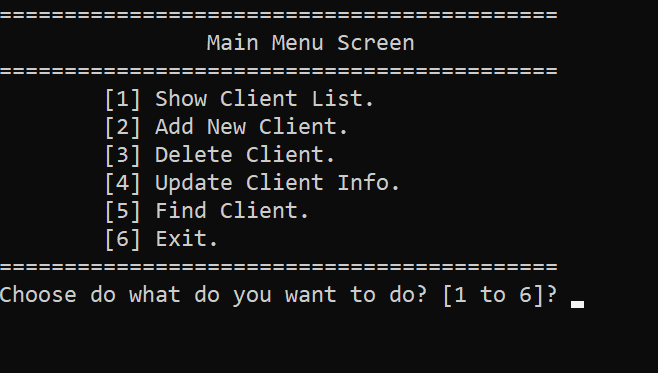
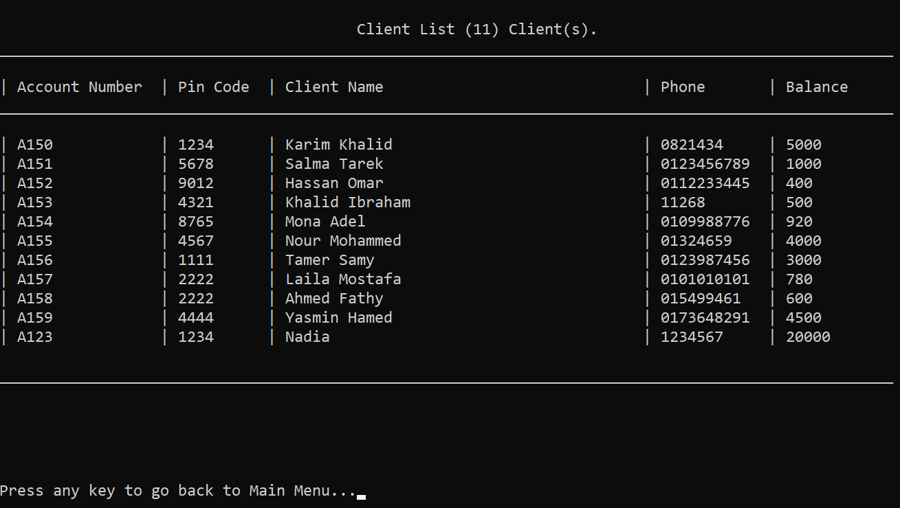
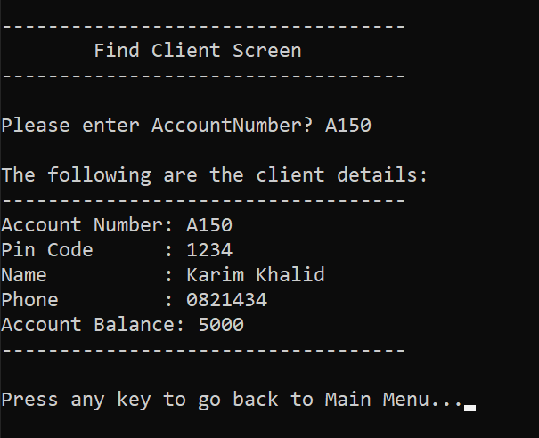

BankSystem - Base Project
==============================

Date Created: June 2025
Project Type: C++ Console Application
Version: 1.0

Overview:
---------
This project is the **base version of a Bank System** designed to manage clients' information in a simple and structured way.
It allows the bank staff to perform the following operations:

Features:
---------
1. Show Client List: Display all clients with details including Account Number, Pin Code, Name, Phone, and Balance.
2. Add New Client: Add new clients to the system with all required information.
3. Delete Client: Remove clients from the system based on their Account Number.
4. Update Client Info: Modify any client information.
5. Find Client: Search for a client using their Account Number.
6. Exit Program: Close the application safely.

File Management:
----------------
- All client information is stored in a text file named `Clients.txt`.
- Data is stored in the following format per line:
  AccountNumber#//#PinCode#//#Name#//#Phone#//#Balance

How to Run:
-----------
1. Clone or download the repository:
   ```bash
   git clone https://github.com/Shehab-Ghitany/bank-management-system-cpp.git
   ```
2. Open the project folder in Visual Studio.
3. Open `BankSystem_Base.sln` solution file.
4. Build the solution and run the application.
5. Follow the console menu to manage clients.

Notes:
------
- This version is a **console-based application** suitable for demonstrating C++ fundamentals.
- Shows structured handling of files, user input, and basic program flow.

Screenshots:
------------

Main Menu:


Show Client List:


Find Client:



Author:
-------
Shehab Ghitany
