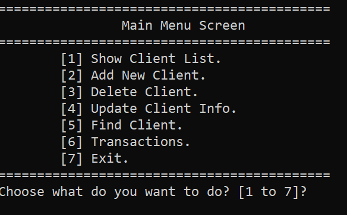
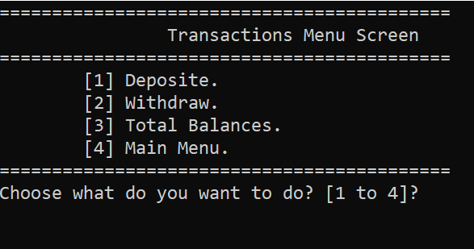
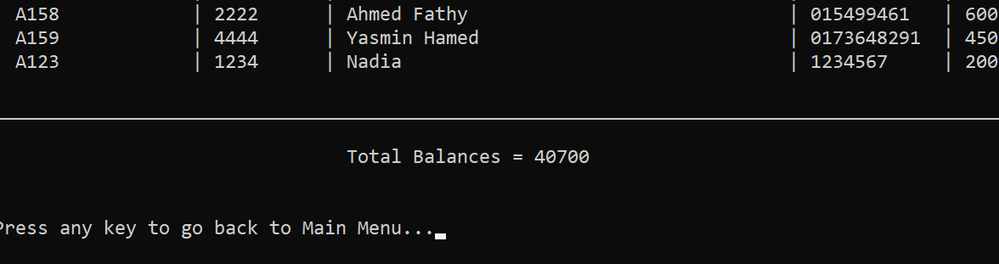

BankSystem - Transactions Project
==============================

Date Created: June 2025
Project Type: C++ Console Application
Version: 2.0

Overview:
---------
This project is the **extended version of the Bank System**. It includes all features from the base version, plus a **Transactions System** to handle deposits, withdrawals, and calculate total balances. 
It provides a more complete simulation of a simple banking environment and demonstrates advanced C++ skills.

Features:
---------
1. Show Client List: Display all clients with details including Account Number, Pin Code, Name, Phone, and Balance.
2. Add New Client: Add new clients to the system with all required information.
3. Delete Client: Remove clients from the system based on their Account Number.
4. Update Client Info: Modify any client information.
5. Find Client: Search for a client using their Account Number.
6. Transactions:
   - Deposit: Add funds to a client's account.
   - Withdraw: Subtract funds from a client's account with balance check.
   - Total Balances: Display all clients with their balances and the sum of all balances.
7. Exit Program: Close the application safely.

File Management:
----------------
- All client information is stored in a text file named `Clients.txt`.
- Data is stored in the following format per line:
  AccountNumber#//#PinCode#//#Name#//#Phone#//#Balance

How to Run:
-----------
1. Clone or download the repository: git clone https://github.com/Shehab-Ghitany/BankSystem.git
2. Open the project folder in Visual Studio.
3. Open `BankSystem_Transactions.sln` solution file.
4. Build the solution and run the application.
5. Follow the console menu to manage clients and perform transactions.

Notes:
------
- This version is a **console-based application** suitable for demonstrating advanced C++ fundamentals.
- Shows structured handling of files, user input, menu-driven systems, and basic transaction logic.

Screenshots:
------------

Main Menu:

Transactions Menu:

Total Balances:

Author:
-------
Shehab Ghitany
