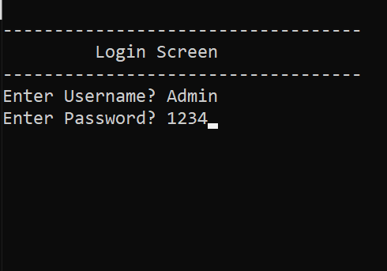
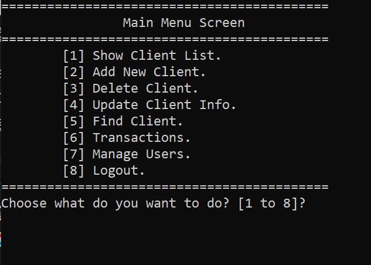
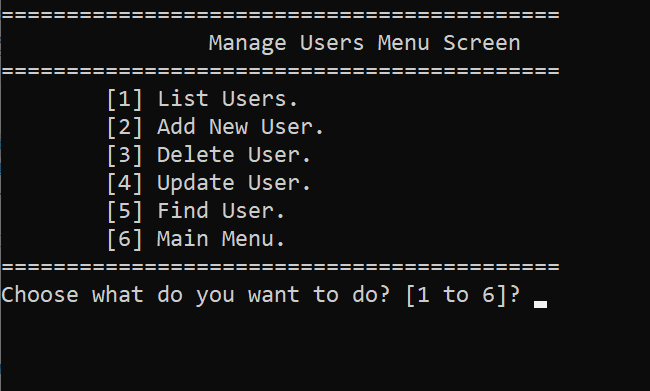

==============================
BankSystem - Users Permission Version
==============================

Date Created: ‎July 2025
Version: 3.0

Overview:
---------
This version of the **Bank System** builds on the base and transaction versions by adding a full **User Accounts and Permissions System**.  
It allows multiple users (Admins / Employees) to log in with their own credentials and access only the operations they are authorized for.

Features:
---------
1. User Login System: Each user must log in using a username and password.  
2. Permissions Control: Admin can assign different permissions to each user (Add Client, Delete, Update, Transactions, etc.).  
3. Client Management: View, Add, Delete, Update, and Find clients (same as previous versions).  
4. Transaction Features: Deposit, Withdraw, and Check Balances.  
5. Total Balances: Display total money in the bank.  
6. Manage Users: Add, Edit, Delete, or List system users (Admin only).  
7. Secure Logout: Return to the login screen safely.

File Management:
----------------
- Client data is stored in `Clients.txt`  
- User data and permissions are stored in `Users.txt`  
- File format for users:  
  `Username#//#Password#//#Permissions`

How to Run:
-----------
1. Clone or download the repository:
   ```bash
   git clone https://github.com/Shehab-Ghitany/BankSystem.git
   ```
2. Open the project folder in Visual Studio.  
3. Open `BankSystem_UsersPermission.sln` solution file.  
4. Build and run the program.  
5. Log in using a test user or Admin account to access the system.

Notes:
------
- This version demonstrates **multi-user systems, file handling, and role-based permissions**.  
- Ideal for showcasing **advanced C++ OOP and file I/O skills**.  
- Prepares the base for future upgrades (GUI / Database integration).

Screenshots:
------------
Login Screen:  


Main Menu:  


Manage Users Menu (Admin):  


Author:
-------
Shehab Ghitany
