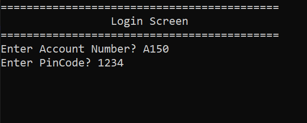
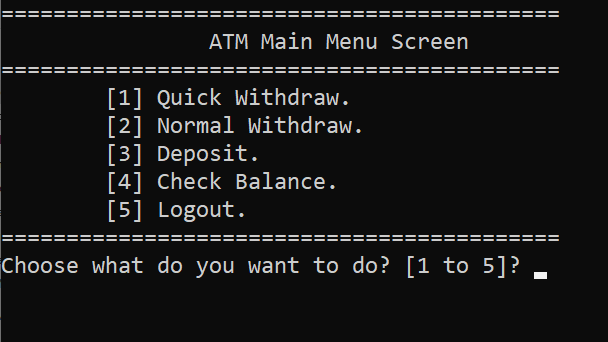
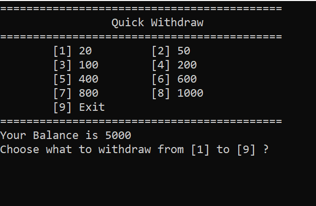
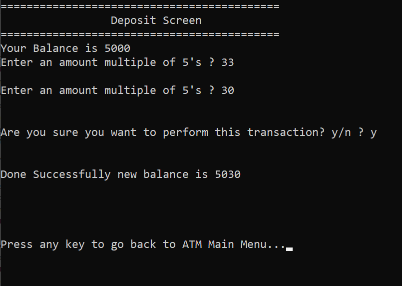

BankSystem - ATM Interface Version
==============================


**Date Created:** July 2025  
**Version:** 4.0


Overview:
---------
This version of the **Bank System** transforms the project into a real **ATM Interface** that clients can directly use to perform transactions.  
It simulates a real ATM experience — allowing users to log in, withdraw, deposit, and check balances — all through a clean, interactive console menu.

Features:
---------
1. **Login System:**  
   Clients must log in using their Account Number and Pin Code.

2. **Quick Withdraw:**  
   Choose from predefined withdrawal amounts (20, 50, 100, etc.) for fast access.

3. **Normal Withdraw:**  
   Withdraw any custom amount (multiple of 5) with balance validation.

4. **Deposit Money:**  
   Add funds to the account securely.

5. **Check Balance:**  
   Instantly view the current balance of the logged-in client.

6. **Logout Option:**  
   Safely return to the login screen to allow other clients to use the ATM.

File Management:
----------------
- Client data is stored in `Clients.txt`  
- Each line in the file represents one client record formatted as:  
  `AccountNumber#//#PinCode#//#Name#//#Phone#//#AccountBalance`  
- The system automatically updates balances after every transaction.

How to Run:
-----------
1. Clone or download the repository:

   ```bash
   git clone https://github.com/Shehab-Ghitany/BankSystem.git
   ```
Open the project folder in Visual Studio.

Open the solution file:
BankSystem_ATM.sln

Build and run the program.

Log in using a valid client account from Clients.txt to access the ATM.

Notes:

This version focuses on client-side ATM operations only (no admin menus).

Demonstrates strong file handling, validation logic, and transaction management.

Ideal for showcasing applied C++ programming, file I/O, and user experience design in console apps.

Screenshots:

Login Screen:


ATM Main Menu:


Quick Withdraw Menu:


Deposit Screen:



Author:

Shehab Ghitany