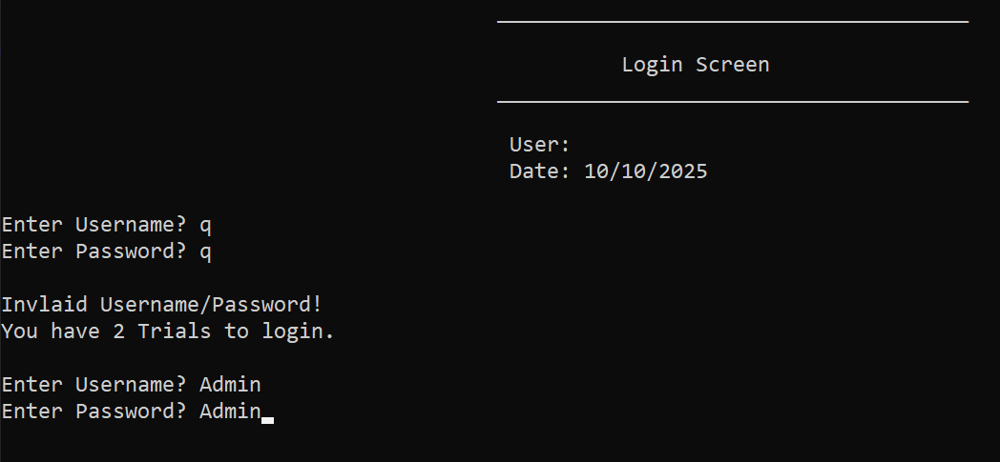
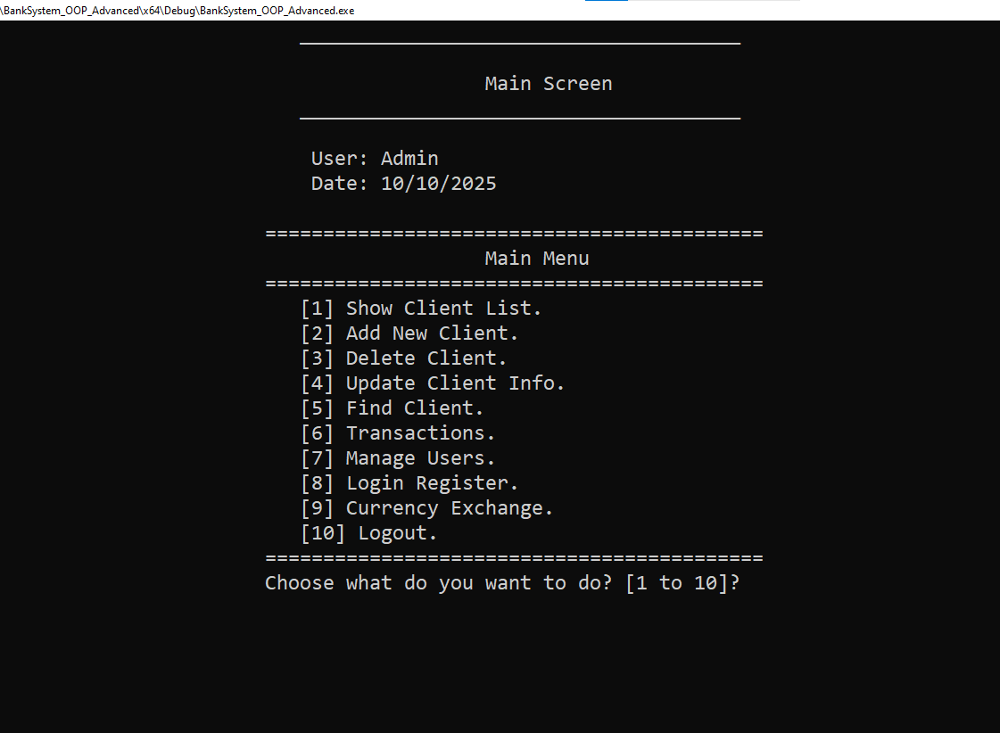
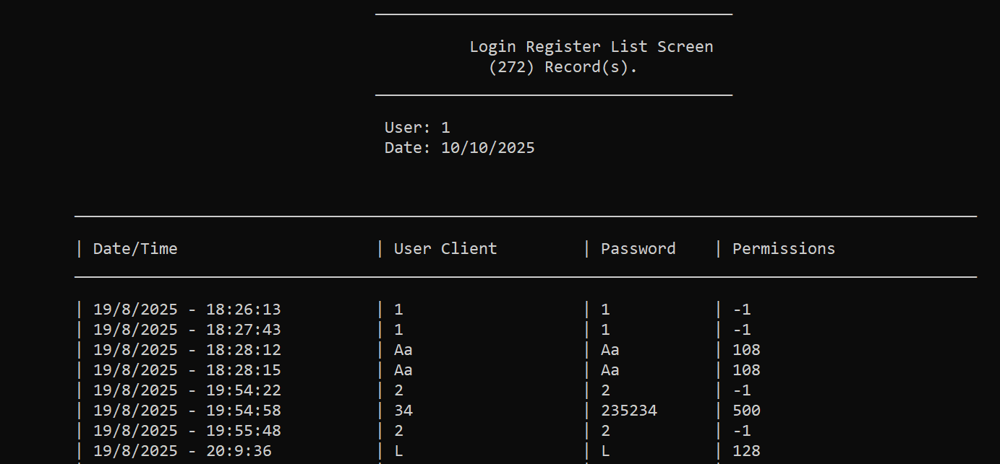
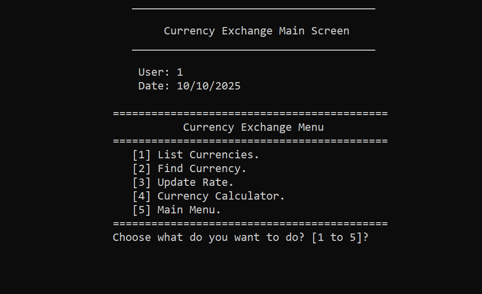
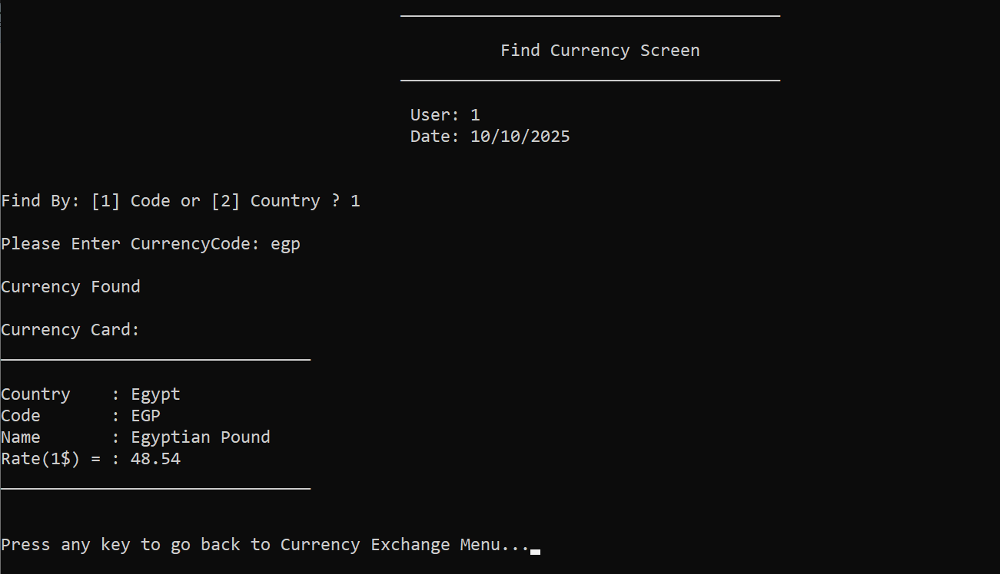
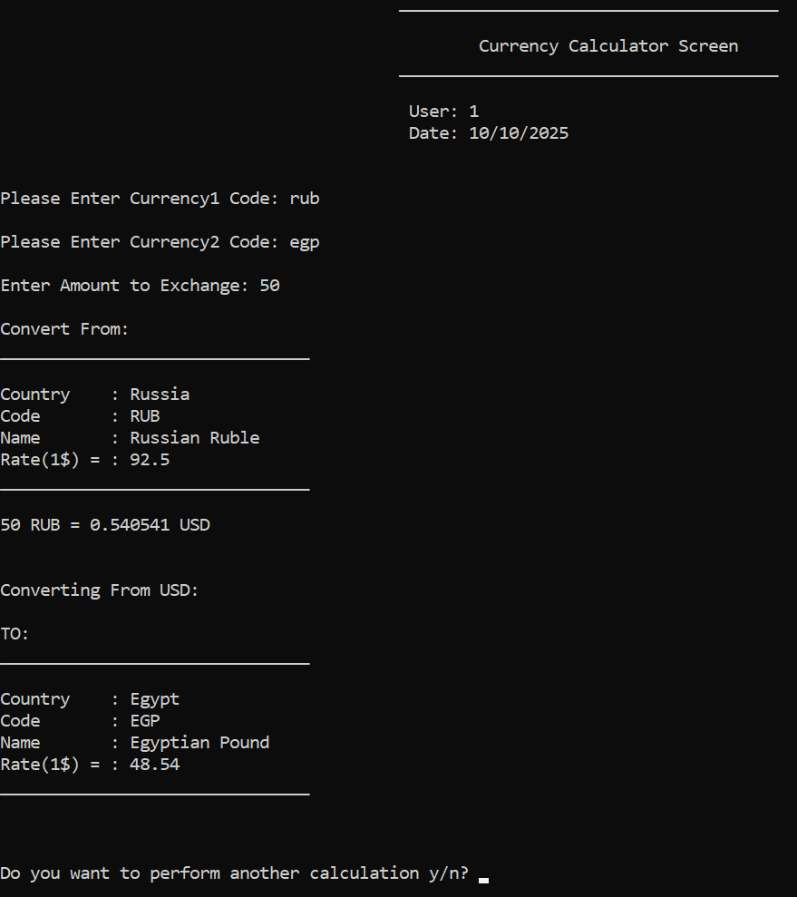

Bank Management System (OOP Version)
==============================

**Date Created:** August 2025  
**Version:** 5.0

Overview:
---------
This project is an object-oriented C++ implementation of a bank management system.
It is organized as modular screen classes and business classes (clients, users, transactions, currencies).
The system supports multi-user login with role/permission control, full client CRUD, deposits/withdrawals/transfers,
transfer logging, login/register audit logs with timestamps, and a currency exchange module.

Key Features:
-------------
- Multi-user Login & Registration (username + password).  
- Role / Permission system: grant specific rights (list/add/delete/update/find clients, transactions, manage users, etc.).  
- Client management: Create / Read / Update / Delete (full client records stored in text files).  
- Transactions: Deposit, Withdraw, Transfer with validation and account balance updates.  
- Transfer Log: every transfer is recorded to a log file (who sent, who received, amount, date/time, notes).  
- Login/Register Audit: records with date/time who logged in / registered (keeps history).  
- Password storage: simple reversible encryption used for stored passwords (utility class e.g., `clsUtil::EncryptText`).  
  (Note: encryption is simple shift-like for demo purposes — replace with secure hashing for production.)  
- Currency exchange module: stores rates, list/search/update rates, and a currency calculator.  
- Clean modular OOP structure: each screen/feature is implemented in its own class/header (≈ 35 headers in this project).  
- File-based persistence: plain text files (easy to inspect, portable for demo).

Architecture & Important Modules:
---------------------------------
(Representative list — project contains many classes / headers)
- `clsLoginScreen`           — login logic & screen flow.  
- `clsMainScreen`            — central menu and routing to modules.  
- `clsClientListScreen`      — show / list clients.  
- `clsAddNewClientScreen`    — add client UI & logic.  
- `clsDeleteClientScreen`    — delete client UI & logic.  
- `clsUpdateClientScreen`    — update client UI & logic.  
- `clsFindClientScreen`      — find client UI.  
- `clsTransactionsScreen`    — deposit / withdraw / transfer / transfer log.  
- `clsManageUsersScreen`     — add/update/delete/list users and set permissions.  
- `clsLoginRegisterScreen`   — login/register audit viewer.  
- `clsCurrencyExchangeScreen`— currencies list, calculator, update rates.  
- `clsBankClient`, `clsBankUser` — core entities with methods for file I/O and operations.  
- `clsScreen`, `clsInputValidate`, `clsUtil`, `Global.h` — shared utilities, validation, global state (e.g., CurrentUser).

Persistence / Files:
--------------------
Project uses plain text files located in the project root (or a configured data folder). Typical filenames used:
- `Clients.txt`          — client records (AccountNumber#//#PinCode#//#Name#//#Phone#//#Balance).  
- `Users.txt`            — user records (Username#//#EncryptedPassword#//#Permissions).  
- `LoginRegister.txt`    — login/register audit log (Date/Time | Username | Password/Encrypted | Permissions).  
- `TransferLog.txt`      — transfer history (Date/Time | FromAccount | ToAccount | Amount | Notes).  
- `Currencies.txt`       — currency list and rates (Country | Code | Name | RatePer1USD).  

(Exact filenames are included in the project — confirm names in the solution if different.)

Default / Demo Credentials:
---------------------------
- Example admin account used in code:  
  - **Username:** `Admin`  
  - **Password:** `Admin`  
  (This account is protected from deletion in the demo code. Use it to access admin menus and manage users.)

How to Run:
-----------
1. Clone or download the repository:
   ```bash
   git clone https://github.com/Shehab-Ghitany/bank-management-system-cpp.git
   ```
2. Open the project folder in Visual Studio.  
3. Open solution file (OOP project): `BankSystem_OOP_Advanced.sln`.
4. Build the solution and run the application.  
5. Log in with an existing user (or `Admin/Admin` for admin access) to reach the Main Screen and explore menus.


Screenshots:
------------
Below are sample screenshots taken directly from the console application.

Login Screen:


Main Screen:


Login Register List Screen:


Currency Exchange Screen:


Find Currency Screen:


Currency Calculator Screen:


Developer Notes / Design Decisions:
-----------------------------------
- Persistence is file-based (text files) for portability and ease of demo/testing. For production, migrate to a proper DB (SQLite / MySQL / PostgreSQL).  
- Passwords are stored with a **simple reversible encryption** utility (used to demonstrate encrypt/decrypt flow). For real deployments use salted hashing (bcrypt / Argon2).  
- Code is modular and OOP-focused: each screen or major responsibility is a class/header. About ~35 header files split by feature.  
- Login/register and transfer logs are kept for audit/history; date/time stamps are recorded for traceability.  
- Unit tests and CI are not included — recommended next steps if turning this into a production repo.

Suggested Next Improvements:
---------------------------
- Replace text files with a DB backend and use transactions for atomicity.  
- Replace reversible password encryption with proper password hashing.  
- Add unit tests for core business logic (clients, transfers, currency conversion).  
- Create a GUI (desktop) or web UI on top of the current logic.  
- Add role-based UI hiding (menu items hidden if user lacks permission) in addition to runtime guard checks.

Code Organization:
------------------------------------
05-OOP-Advanced/
├─ BankSystem_OOP_Advanced.sln
├─ (.cpp / .h files)
├─ Clients.txt
├─ Users.txt
├─ LoginRegister.txt
├─ TransferLog.txt
├─ Currencies.txt
├─ Screenshots/
├─ (Other files)
└─ README.md <-- this file


Contact / Author:
-----------------
Shehab Ghitany

---
This project is part of the multi-version Bank System series (Base → Transactions → Users → ATM → OOP).
